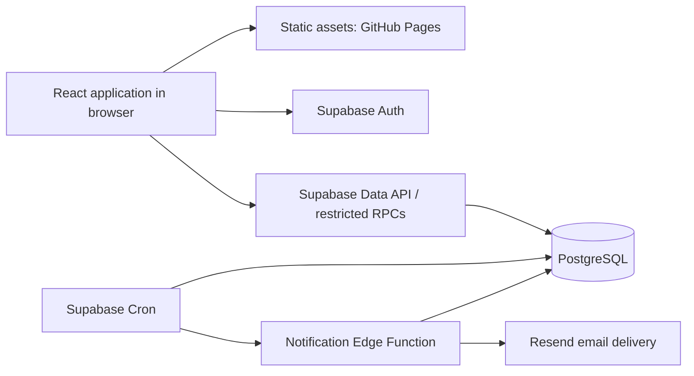

# Architecture and technology stack

## Deployment shape



GitHub Pages serves the compiled browser application. Supabase owns persistent shared state, authorization, transactions, server time, and background processing. The earlier single application-service concept is implemented here as one Supabase backend with database RPCs and a small notification function; a separate general-purpose Node server is unnecessary for this scope.

## Selected stack

| Layer | Choice | Reason / responsibility |
| --- | --- | --- |
| Runtime/tooling | Node.js 24 LTS + npm | Common local/CI build environment; installed locally |
| Frontend | React + TypeScript, strict checking | Components and typed API/data contracts |
| Build | Vite | Static output, local server, repository-path builds |
| Styling | Tailwind CSS with Vite integration, CSS variables | MMI-LIMS-like surfaces, grid styling, theme tokens |
| Calendar | Custom React grid + Pointer Events | Two-resource scope; drag-select, move, resize, keyboard parity |
| Server-state cache | TanStack Query | Fetching, mutation status, invalidation, polling |
| Date handling | Luxon | Explicit IANA-zone display and local date calculations |
| Backend client | `@supabase/supabase-js` | Auth and typed RPC calls |
| Database | Supabase-managed PostgreSQL | Durable transactions, range constraints, server-side quotas |
| Login | Supabase Auth with Google OAuth, proposed | Hosted identity entry, member allowlist; configurable provider |
| Scheduling | Supabase Cron / `pg_cron` | Expiry/completion processing and outbox dispatch |
| Email | Resend through a Supabase Edge Function | Optional delivery channel alongside in-app reminders |
| Unit/UI tests | Vitest + React Testing Library | Rule fixtures, state transitions, accessible interactions |
| Database tests | pgTAP + Supabase CLI | RPC permissions, constraints, quota accounting |
| Concurrency tests | Node test harness + PostgreSQL driver | Independent simultaneous transactions |
| Browser tests | Playwright | Real booking flows and pointer/touch/keyboard checks |
| Quality | ESLint + Prettier + TypeScript compiler | Consistent code and static checks |
| CI/CD | GitHub Actions | Checks, backend migration, Pages artifact deployment |

Pin compatible package versions and the Supabase CLI in Phase 1, and commit `package-lock.json`. Use `npm ci` afterward. Node 24 is the selected LTS line, not a claim about the newest Node release. Verify compatible dependency versions at implementation; none have been installed or tested in this planning deliverable. See [Node releases](https://nodejs.org/en/about/previous-releases).

Vite documents the static output and GitHub Pages base-path requirements in its [deployment guide](https://vite.dev/guide/static-deploy). Tailwind's [Vite integration](https://tailwindcss.com/docs/installation/using-vite) is the intended installation route.

## Component boundaries

- `features/auth`: login, session, membership gate.
- `features/calendar`: day/week rendering, pointer selection, booking cards.
- `features/bookings`: booking form, mutations, check-in, history.
- `features/allowances`: usage and projected usage display.
- `features/admin`: membership, maintenance, audit and job health.
- `lib/time`: UI-only conversions and preview calculations; database remains authoritative.
- `lib/api`: typed RPC wrappers and error translation.
- PostgreSQL functions: all business mutations and authoritative validation.
- Notification worker: outbox delivery only; never the source of reservation validity.

For the first release, refresh the visible calendar every 15 seconds while active, on focus/reconnect, after mutations, and at the next known deadline. This avoids publishing private reservation rows through a realtime feed. The client marks potentially stale data; submit-time validation resolves races.

## Pages-compatible navigation and authentication

Use a single application entry at the deployment root and query-string navigation, such as `/?view=calendar` or `/laido-auto/?view=bookings`. There are no server-side deep routes requiring rewrite rules. OAuth returns to this actual root URL with a PKCE `code` query parameter. Finish the exchange, remove the code, then restore the saved view.

Production credentials are entered at the identity provider, not in a Pages-hosted password form. The application still handles its authenticated session. Google OAuth is a proposed provider choice; verify residents can use it before launch. See [Supabase Google authentication](https://supabase.com/docs/guides/auth/social-login/auth-google).

## Proposed future repository layout

```text
docs/planning/              this specification
src/features/              frontend feature modules
src/lib/                   API, time, config, and shared UI helpers
src/styles/                theme tokens and calendar layout
public/                    static assets
supabase/config.toml       reproducible local backend configuration
supabase/migrations/       schema, functions, grants, jobs
supabase/seed.sql           local-only building/charger fixture data
supabase/tests/            database test suite
supabase/functions/        notification worker
scripts/                   local seeding and test helpers
tests/integration/         concurrent API/database scenarios
tests/e2e/                 Playwright flows
.github/workflows/         CI and deployment, added after implementation
```

## Background processing

Schedule expiry/completion every 10 seconds. The logical deadline is exact; calendar requests and booking mutations handle already expired rows even when the scheduled job is late. Supabase Cron supports sub-minute scheduling and database functions; verify the selected local/hosted versions when implementing. See [Cron documentation](https://supabase.com/docs/guides/cron).

Notification events are inserted transactionally with a unique event key. A worker claims due events with a lease, retries transient failures, and suppresses stale reminders after check-in/cancellation. Reminders occur at start and start + 10 minutes. Delivery is best-effort and cannot extend the deadline. Local mode records messages in a sink without contacting real recipients. Hosted email follows the documented [Edge Function email integration](https://supabase.com/docs/guides/functions/examples/send-emails).
